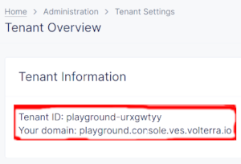

## Overview

Terraform templates to create F5XC AWS cloud CE (manual mode deployment).

## Requirements

| Name                                                                                     | Version   |
|------------------------------------------------------------------------------------------|-----------|
|  [terraform](https://github.com/hashicorp/terraform) | \>= 1.3.0 |
|  [curl](https://curl.se/)                                 | \>= 1.7   |
|  [git](https://git-scm.com/)                               | \>= 8.0   |
|  [jq](https://jqlang.github.io/jq/)                         | latest    |

### OS Platform

| Name            | Status      |
|-----------------|-------------|
| Linux           | supported   |
| Mac OS (Sonoma) | supported   |
| Windows         | unsupported |

## Installation

- Git (https://git-scm.com/book/en/v2/Getting-Started-Installing-Git)
- Terraform (https://developer.hashicorp.com/terraform/install?product_intent=terraform)
- F5 XC Credentials (https://docs.cloud.f5.com/docs/how-to/user-mgmt/credentials)
    * API Certificate
- SSH public key
    * ssh-keygen -t rsa -b 4096 -C "your_email@example.com"
- F5 XC full tenant name
    * Obtain full tenant name in XC web console by navigating to administration page --> tenant settings
    * 

## Usage

- Clone this repo with: `git clone --recurse-submodules https://github.com/f5devcentral/terraform-xc-aws-ce`
- Enter repository directory with: `cd terraform-xc-aws-ce`
- Follow usage description in __topologies__ section
- Multiple examples in example directory are available. Change to example directory that is to be deployed
  with `cd examples/<example_dir_name>`

## Input variables

Description of available input variables. Used input variables will change per topology example:

| Name                          | Description                                                                                                        |
|-------------------------------|--------------------------------------------------------------------------------------------------------------------|
| owner                         | Tag aws objects with creator / owner email address                                                                 |
| project_prefix                | String added at the beginning of various AWS / F5 XC object identifier. `<project_prefix>_<object>`                |
| project_suffix                | String added at the end of various AWS / F5 XC object identifier. `<project_prefix>_<object>_<project_suffix>`     |
|                               | Example prefix + suffix for F5XC site name `project_prefix_cluster_name_project_suffix`                            |
|                               |                                                                                                                    |
| f5xc_tenant                   | Full f5 xc tenant name e.g. playground-abcdefg                                                                     |
| f5xc_api_url                  | F5 XC API URL e.g. https://https://playground.console.ves.volterra.io/api                                          |
| f5xc_aws_region               | AWS region to deploy site in e.g. "us-west-2"                                                                      |
| f5xc_cluster_name             | F5 XC cluster name e.g. "aws-ce-test"                                                                              |
| f5xc_api_p12_file             | Path to F5 XC exported API cert file                                                                               |
| f5xc_aws_availability_zone    | AWS availability zone to deploy object in                                                                          |
|                               |                                                                                                                    |
| aws_existing_vpc_id           | Id of existing AWS VPC e.g. vpc-089de438436174ab7                                                                  |
| aws_existing_sg_slo_ids       | SLO comma separated list of security group id strings e.g. ["id-1", "id-2", "id-3"]. Leave empty to omit injection |
| aws_existing_sg_sli_ids       | SLI comma separated list of security group id strings e.g. ["id-1", "id-2", "id-3"]. Leave empty to omit injection |
| aws_slo_subnet_id_node`X`     | Per node slo (outside interface) existing subnet id                                                                |
| aws_sli_subnet_id_node`X`     | Per node sli (inside interface) existing subnet id                                                                 |
| aws_existing_key_pair_id      | Inject existing ssh key pair `id`                                                                                  |
| aws_existing_iam_profile_name | Inject existing iam profile `name`                                                                                 |

## Topologies

| Name                                                                         | Description                                                                                       |
|------------------------------------------------------------------------------|---------------------------------------------------------------------------------------------------|
| Single Node Single NIC new VPC / subnet                                      | [Description](examples/single_node_single_nic_new_vpc_new_subnet/README.md)                       |
| Single Node Multi NIC new VPC / subnet                                       | [Description](examples/single_node_multi_nic_new_vpc_new_subnet/README.md)                        |
| Single Node Single NIC Existing VPC / new subnet                             | [Description](examples/single_node_single_nic_existing_vpc_new_subnet/README.md)                  |
| Single Node Multi NIC Existing VPC / new subnet                              | [Description](examples/single_node_multi_nic_existing_vpc_new_subnet/README.md)                   |
| Single Node Single NIC existing VPC / subnet                                 | [Description](examples/single_node_single_nic_existing_vpc_existing_subnet/README.md)             |
| Single Node Multi NIC existing VPC / subnet                                  | [Description](examples/single_node_mulit_nic_existing_vpc_existing_subnet/README.md)              |
| Single Node Multi NIC existing VPC / new subnet with SLO no EIP / AWS NAT GW | [Description](examples/single_node_multi_nic_existing_vpc_and_subnet_nat_no_eip/README.md)        |
| Single Node Single NIC existing VPC / subnet and 3rd party NAT GW            | [Description](examples/single_node_single_nic_existing_vpc_and_subnet_3rd_party_nat_gw/README.md) |
| Single Node Multi NIC existing VPC / subnet and 3rd party NAT GW             | [Description](examples/single_node_multi_nic_existing_vpc_and_subnet_3rd_party_nat_gw/README.md)  |
| Single Node Appstack Cluster new VPC / subnet                                | [Description](examples/single_node_cluster_appstack_new_vpc_new_subnet/README.md)                 |
| Single Node Appstack Cluster existing VPC / new subnet                       | [Description](examples/single_node_cluster_appstack_existing_vpc_new_subnet/README.md)            |
| Three Node Cluster Single NIC new VPC / subnet                               | [Description](examples/three_node_cluster_single_nic_new_vpc_new_subnet/README.md)                |
| Three Node Cluster Single NIC existing VPC / new subnet                      | [Description](examples/three_node_cluster_single_nic_existing_vpc_new_subnet/README.md)           |
| Three Node Cluster Single NIC existing VPC / subnet                          | [Description](examples/three_node_cluster_single_nic_existing_vpc_existing_subnet/README.md)      |
| Three Node Cluster Multi NIC new VPC / subnet                                | [Description](examples/three_node_cluster_multi_nic_new_vpc_new_subnet/README.md)                 |
| Three Node Cluster Multi NIC existing VPC / new subnet                       | [Description](examples/three_node_cluster_multi_nic_existing_vpc_new_subnet/README.md)            |
| Three Node Appstack Cluster new VPC / subnet                                 | [Description](examples/three_node_cluster_appstack_new_vpc_new_subnet/README.md)                  |
| Three Node Appstack Cluster existing VPC / new subnet                        | [Description](examples/three_node_cluster_appstack_existing_vpc_new_subnet/README.md)             |

## Feature specific examples

| Name                                                                            | Description                                                                               |
|---------------------------------------------------------------------------------|-------------------------------------------------------------------------------------------|
| Single Node with offline survivability mode and l3 performance enhancement mode | [Description](examples/single_node_single_nic_new_vpc_new_subnet_jframe_l7_osm/README.md) |

## ClickOps

Find CE cloud-config example for ClickOps deployment at [Cloud-Config](clickops/f5-ce-data.yml)

## Support

For support, please open a GitHub issue. Note, the code in this repository is community supported and is not supported
by F5 Networks. For a complete list of supported projects please reference [SUPPORT.md](SUPPORT.md).

## Community Code of Conduct

Please refer to the [F5 DevCentral Community Code of Conduct](code_of_conduct.md).

## License

[Apache License 2.0](LICENSE)

## Copyright

Copyright 2014-2020 F5 Networks Inc.

### F5 Networks Contributor License Agreement

Before you start contributing to any project sponsored by F5 Networks, Inc. (F5) on GitHub, you will need to sign a
Contributor License Agreement (CLA).

If you are signing as an individual, we recommend that you talk to your employer (if applicable) before signing the CLA
since some employment agreements may have restrictions on your contributions to other projects.
Otherwise, by submitting a CLA you represent that you are legally entitled to grant the licenses recited therein.

If your employer has rights to intellectual property that you create, such as your contributions, you represent that you
have received permission to make contributions on behalf of that employer, that your employer has waived such rights for
your contributions, or that your employer has executed a separate CLA with F5.

If you are signing on behalf of a company, you represent that you are legally entitled to grant the license recited
therein.
You represent further that each employee of the entity that submits contributions is authorized to submit such
contributions on behalf of the entity pursuant to the CLA.
