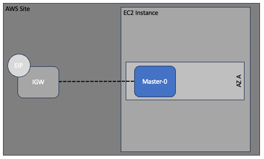

# Example Single node single NIC new VPC new subnet with Offline Survivability Mode, L3 Mode Enhanced Performance and Jumbo Frame 

This example instantiates:

- Single node CE cluster with Offline Survivability Mode, L3 Mode Enhanced Performance with jumbo frame enabled
- AWS SLO interface
- AWS VPC
- AWS SLO interface subnet
- AWS route tables
- AWS Internet Gateway
- Assign AWS EIP to SLO

## Topology

# Usage

- Export AWS_ACCESS_KEY with: `export AWS_ACCESS_KEY_ID="aws access key id"`
- Export AWS_SECRET_ACCESS_KEY with: `export AWS_SECRET_ACCESS_KEY=aws secret access key"`
- Export F5 XC API certificate password with: 
  * `export VES_P12_PASSWORD="p12 password"`
  * `export TF_VAR_f5xc_api_p12_cert_password="$VES_P12_PASSWORD"`
- Edit `terraform.tfvars` file to align with your environment
- Copy F5XC API certificate file obtained in installation step into example directory
- Initialize with: `terraform init`, optionally run `terraform plan`
- Apply with: `terraform apply -auto-approve` or destroy with: `terraform destroy -auto-approve`